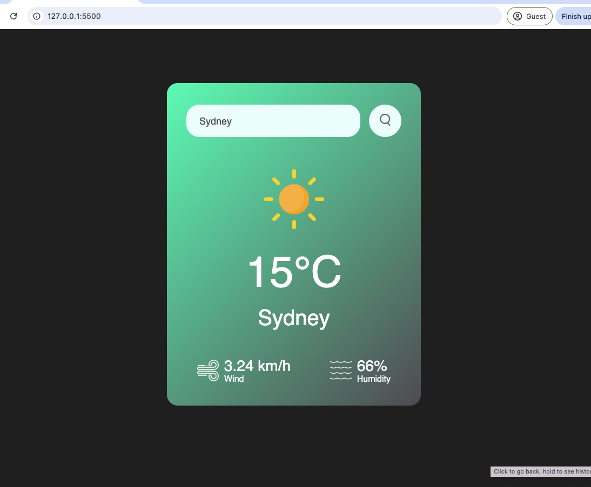

# Weather App

A simple and modern weather application that allows users to search for the current weather in any city. The app displays temperature, city name, weather icon, humidity, and wind speed, using real-time data from the OpenWeatherMap API.


## Features
- Search for weather by city name
- Displays temperature, humidity, wind speed, and weather condition icon
- Responsive and clean UI
- Error handling for invalid city names

## Key Technologies
- **HTML5**: Markup for the app structure
- **CSS3**: Custom styling for a modern, responsive design
- **JavaScript (ES6+)**: Handles API requests, DOM updates, and user interactions
- **OpenWeatherMap API**: Provides real-time weather data

## Project Structure
```
/Weather app
├── index.html         # Main HTML file
├── weather.js         # JavaScript logic for fetching and displaying weather
├── weather.css        # Styling for the app
├── images/            # Weather icons and search icon
```

## Getting Started

### Prerequisites
- A modern web browser (Chrome, Firefox, Edge, Safari, etc.)
- (Optional) A simple HTTP server for local development (e.g., VSCode Live Server, Python's http.server)

### Clone the Repository
```bash
git clone https://github.com/Shirleysyd/Weather-App
```

### Run the App
1. **Open `index.html` directly in your browser**

## Usage
- Enter a city name in the search box and press Enter or click the search button.
- The app will display the current weather, temperature, humidity, and wind speed for the city.
- If the city name is invalid, an error message will appear.


## API Reference
- [OpenWeatherMap API](https://openweathermap.org/current)

